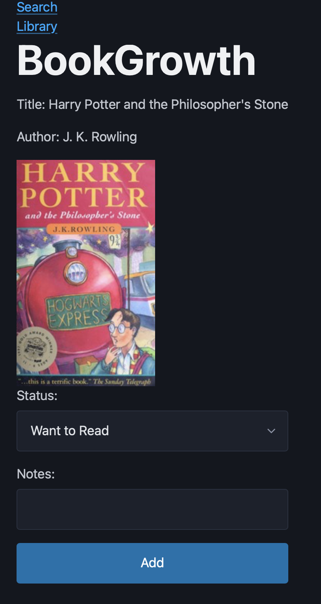

# BookGrowth

## Description

BookGrowth is a book tracking application that allows users to search for books using the OpenLibrary API and save them into a personal reading library.

Users can:
- Search for books
- View book details
- Save books to a personal library
- Add notes and reading status
- Delete books from the library

Saved books are stored using the Airtable API so that the data persists even after refreshing the page.

The goal of this project was to practice building a full React application that integrates multiple APIs and implements CRUD functionality.

---

## Getting Started

### Live App
https://book-growth-react-api-project.netlify.app

### GitHub Repository
https://github.com/josephngjr07/book-growth-react-api-project

### Planning Materials
- Wireframes
- User Stories

---

## Technologies Used

- React
- JavaScript
- React Router
- Fetch API
- Airtable API
- OpenLibrary API
- HTML
- CSS

---

## Attributions

OpenLibrary API  
https://openlibrary.org/developers/api

Airtable API  
https://airtable.com/api

Book cover images provided by OpenLibrary.

---

## Next Steps

Planned future improvements:

- Edit saved books
- Add book rating system
- Filter books by status (Want to Read / Reading / Finished)
- Add user authentication
- Improve UI styling with a component library

## Wireframe

#Header
- BookGrowth

#Search Bar
[Search Books]             [Search]

##Result List
Title:
Author:

Save Form (Add Status + Notes)
Status:
Notes:

Saved Books List
My Library  - Filter by Status / Topic
Title:
Author:
Status: Drop Down List 
Notes:
[Delete]
